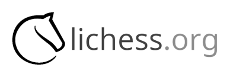

<div align="center" id="top"> 
  

  &#xa0;

  <!-- <a href="https://lichessorgdiscordrpc.netlify.app">Demo</a> -->
</div>

<h1 align="center">Lichessorg Discordrpc</h1>

<p align="center">
  

  

  

  

  
</p>

<!-- Status -->

<!-- <h4 align="center"> 
	🚧  Lichessorg Discordrpc 🚀 Under construction...  🚧
</h4> 

<hr> -->

<p align="center">
  <a href="#dart-about">About</a> &#xa0; | &#xa0; 
  <a href="#sparkles-features">Features</a> &#xa0; | &#xa0;
  <a href="#rocket-technologies">Technologies</a> &#xa0; | &#xa0;
  <a href="#white_check_mark-requirements">Requirements</a> &#xa0; | &#xa0;
  <a href="#checkered_flag-starting">Starting</a> &#xa0; | &#xa0;
  <a href="#memo-license">License</a> &#xa0; | &#xa0;
  <a href="https://github.com/awesomehet2124" target="_blank">Author</a>
</p>


<br>

## :dart: About ##

Shows a beautiful Discord Activity Rich Presence in your profile

## :sparkles: Features ##

:heavy_check_mark: Feature 1; Shows your current status in your discord activity\
:heavy_check_mark: Feature 2; Has a button for other people so that they can see your live game\
:heavy_check_mark: Feature 3 Its easy to use;

## :rocket: Technologies ##

The following tools were used in this project:

- [PyPresence](https://pypi.org/project/pypresence/)
- [Requests](https://pypi.org/project/requests)

## :white_check_mark: Requirements ##

Before starting :checkered_flag:, you need to have 
- [PyPresence](https://pypi.org/project/pypresence/), [Requests](https://pypi.org/project/requests) and [Python](https://python.org/)  installed. **Also, you need to put your lichess id in the `config.py` file**

## :checkered_flag: Starting ##

```bash
# Clone this project
$ git clone https://github.com/awesomehet2124/lichessorg-discordrpc

# Access
$ cd lichessorg-discordrpc

# Run the project
$ python main.py

```

## :memo: License ##

This project is under license from MIT. For more details, see the [LICENSE](LICENSE) file.


Made with :heart: by <a href="https://github.com/awesomehet2124" target="_blank">awesomehet2124</a>
Contributed by <a href="https://github.com/SakshhamTheCoder" target="_blank">SakshhamTheCoder</a>

&#xa0;

<a href="#top">Back to top</a>
